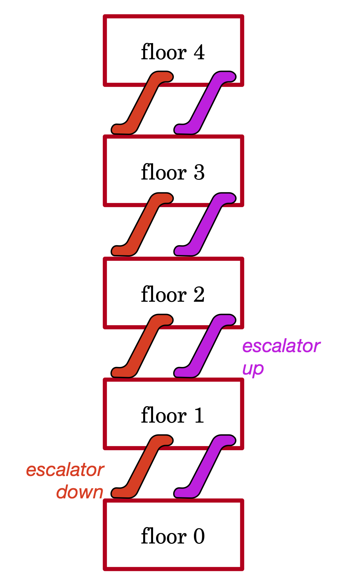
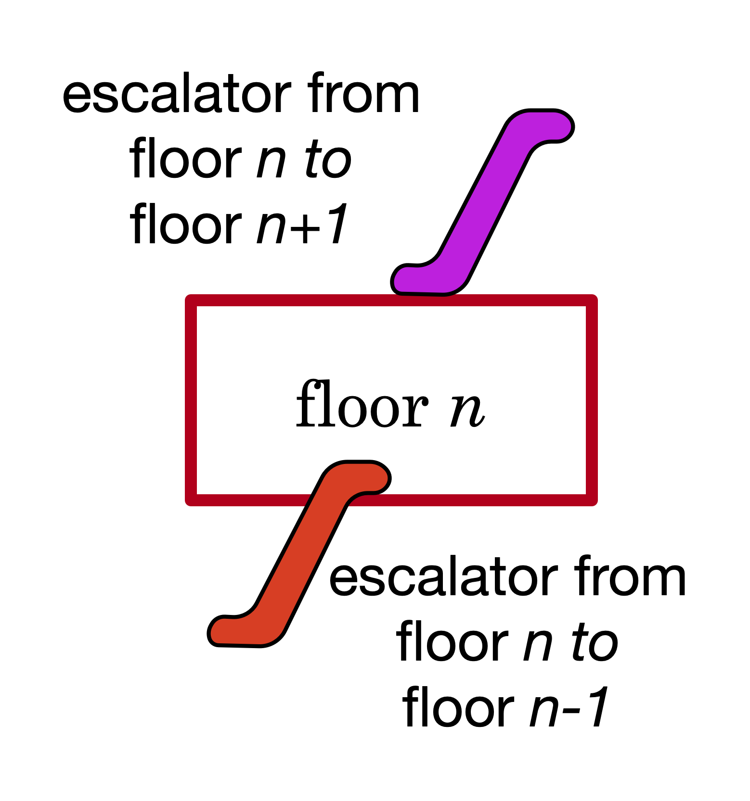
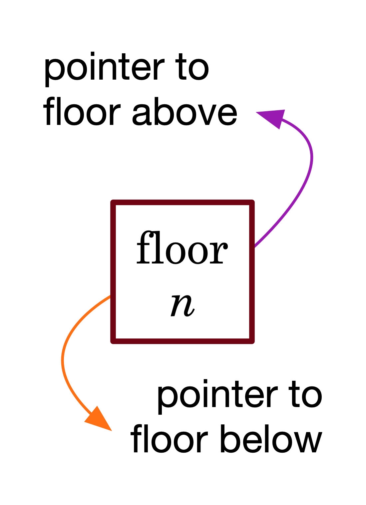
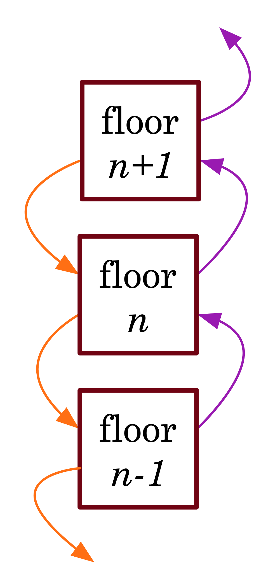
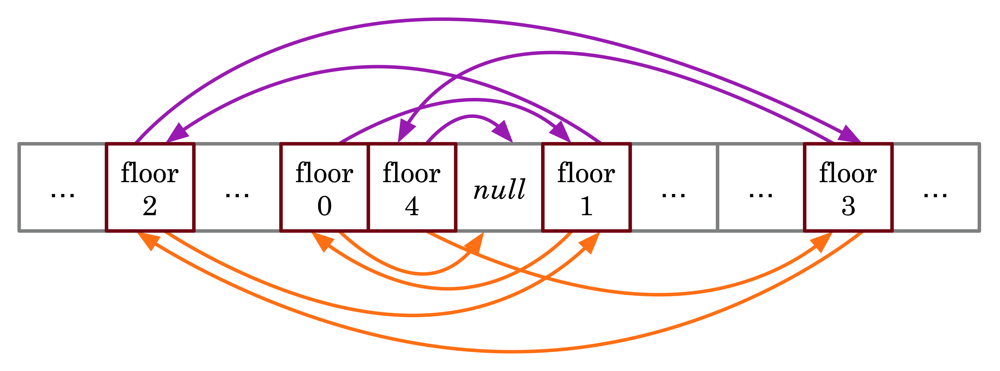

Review of Week 10 and Week 11
=======================================================

Inheritance
-------------------------

Data Structures
------------------

Data structures are how computers "perceive" our world. More precisely, data structures are mechanisms we develop, to translate our world into computer memory. 

Computer memory is a linear structure: one storage location after another. Our view of the world is a bit more sophisticated than that. 

To illustrate the difference between our perception of the world and the computer's linear perspective, we look at a 5-story building as an example. The floors are connected with escalators. Purple escalators go up. Orange escalators go down.

A floor in this building is modeled as an entity with an elevator going up to the next floor, and an elevator going to the floor below. There are two special floors in the building. A floor without a down escalator: the lowest floor of the building. And a floor without an up escalator: the top floor.

How do we model a floor, in software? In Java, obviously, we need a Class that we'll name ``Floor``. What will be the fields that describe the members of this Class. Maybe a number indicating the rank of the floor. And definitely information as to what floor is above and what floor is below.

.. code-block:: java

   public class Floor {
    private int floorNumber;
    private Floor above;
    private Floor below;
   }
   
The first thing we notice in Class ``Floor`` is that it contains two fields that are members of the class. Is this a chicken-and-egg problem? How can we possibly instantiate the first ever Floor object, when we have nothing to use for above and below? It all comes down to how we define the constructors and mutators of the class.

.. code-block:: java

   public class Floor {
   
    private int floorNumber;
    private Floor above;
    private Floor below;
	
    public Floor() {
     floorNumber = 0;
     above = null;
     below = null;
    } // default constructor
	
    public void setAbove(Floor above) { this.above = above; }
	
    public void setBelow(Floor below) { this.below = below; }
	
    public void setFloorNumber(int floorNumber) {this.floorNumber = floorNumber; }
	
   }

The default constructor ``Floor()`` allows us to create a Floor object without specifying which floors are above and below it. The corresponding objects ``above`` and ``below`` are initialized to a ``null`` value when the default constructor is called. This way we can instantiate a couple of floors before connecting them together:

.. code-block:: java

   Floor ground = new Floor();
   Floor first = new Floor();
   
   ground.setAbove = first; // floor above ground floor
   
   first.setBelow = ground; // floor below first floor
   first.setFloorNumber(1);
   
   Floor second = new Floor();
   
   second.setFloorNumber(2);
   second.setBelow = first; // floor below second floor
   first.setAbove = second; // floor above first floor

We can simplify the code above, by introducing a parameterized constructor in the Class that will reduce the need for the ``setFloorNumber`` mutator:   

.. code-block:: java
    
    private Floor(int floorNumber) {
     this.floorNumber = floorNumber;
     above = null;
     below = null;
    } // parameterized constructor for floorNumber
	
And the corresponding, simplified code is:

.. code-block:: java

   Floor ground = new Floor();
   Floor first = new Floor(1);
   
   ground.setAbove = first; // floor above ground floor
   
   first.setBelow = ground; // floor below first floor
   
   Floor second = new Floor(2);
   
   second.setBelow = first; // floor below second floor
   first.setAbove = second; // floor above first floor

   

A singular floor object comprises a floor number, and two pointers: to the floor ``above`` and the floor ``below1``. A floor between two floors is associated with four points. Two of these pointers are its own ``above`` and ``below``. The other two are the ``below`` pointer from the floor above, and the ``above`` points from the floor below. It may look confusing but it is actually quite simple, as long as you keep in mind that a floor basically has two pointers radiating from it and towards other floors.

Ultimately, these floor objects must be stored in the computer's memory. The computer may scatter these floors all over its memory, and that's why these points are more important than ever: no matter where the computer stores these floor objects, we can follow the ``above`` (purple) and ``below`` (orange) pointers to find adjacent floors.

