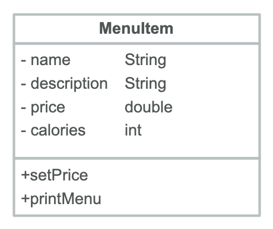

Review of Week 6
=================

As we continue our exploration of Classes and Methods, and the fine line between programmers as Users and programmers as Developers, we are practicing the design and implementation of simple but illustrative examples.

   
For this week's example, we act in our capacity as programmers-Developers to design and implement a class for menu items that will be part of a larger application for restaurants; shown to the right. After much deliberations, we settled on naming the class ``MenuItems``. 

The ae Phil Karlton, an iconoclast pioneer in computer programming, once quipped that "there are only two hard things in Computer Science: cache invalidation and `naming things <https://www.njtierney.com/post/2018/06/20/naming-things/>`_." [*]_ So in a tribute to Phil, I changed the name of the class to ``MenuItem`` (singular)!

We readily mapped this design to the following code: 

.. literalinclude:: ../codeExamples/User-v-Dev/MenuItem.java
   :linenos:
   :language: java

Programers using the class above cannot modify it. For example they cannot add a ``main`` method to it. Well, they can, if we grant them access to the source code, but they shouldn't because they'd be violating the User-Developer separation. The only way for a programmer acting as a User  to interact with the class ``MenuItem`` is through the **public** methods defined within it. As shown above, the class has three public methods: ``MenuItem`` (in three variations), ``setPrice``, and ``printMenu``. If a User determines that these three classes do not provide the desired functionality and therefore the class design does not meet expectations, a request for additional functionality can be made to the development team.

Yet another example of information hiding
-----------------------------------------

Developer's perspective
~~~~~~~~~~~~~~~~~~~~~~~

Another example we worked in class, focused on building a small -- very small -- student information system to be used by the registrar of a tiny college. After discussing whether or not we wish to have separate Classes for undergraduate and graduate students, we decided to use one Class one, and call it ``Student``. The Class will contain a field indicating whether a student is undergraduate or graduate.

.. literalinclude:: ../codeExamples/StudentRecords/src/Student.java
   :linenos:
   :language: java

The Class above gave us an opportunity to talk a little bit about the use of the keyword ``this.`` In the constructor above the parameters we pass are called ``fname``, ``lname``, and ``degreeObjective``. We pass these parameters in the signature of the constructor:

.. code-block:: java
   :emphasize-lines: 1
   
    public Student(String fname, String lname, String degreeObjective) 
        this.fname = fname;
        this.lname = lname;
        this.degreeObjective = degreeObjective;
    } // constructor Student
	
The parameters ``fname``, ``lname``, and ``degreeObjective`` have the same names as the fields of the Class. When the parameters in the signature of a constructor -- and more generally, in the signature of a method -- have the same names as the corresponding fields of the Class that contains the method, we say that the signature *shadows* the fields. In this case we need to differentiate which variables are the fields of the class and which are the parameters passed through a method's signature. We do so by using the prefix ``this.`` to mark the Class fields as shown above. We can avoid shadowing -- and therefore the use of ``this.`` -- if we used different names for the parameters, e.g.

.. code-block:: java
   
    public Student(String firstName, String lastName, String degreeSought) 
        fname = firstName;
        lname = lastName;
        degreeObjective = degreeSought;
    } // constructor Student

Whether we use ``this.`` to resolve the ambiguity of shadowing or avoid such ambiguity all together by using different names for parameters, is a matter of personal programming style. Remember, however, Phil Karlton's aphorism about the difficulty of naming things!

We completed our ``Student`` Class by adding two methods: ``undergradOrGrad`` and ``getNames``. Method  ``undergradOrGrad`` creates and returns a string to indicate if the student is an undergraduate or graduate one. We took care to use the proper indefinite article ("an" or "a") to avoid a glottal stop. Method ``getNames`` returns a string with the first and last names of a student.  

User's perspective
~~~~~~~~~~~~~~~~~~~~~~~

The constructor ``Student`` and the two methods above, are sufficient for us to hand over our masterpiece Class to programmers-users to build their own masterpiece application. The first application to use our Class ``Student``, is the following.

.. literalinclude:: ../codeExamples/StudentRecords/src/Registrar.java
   :linenos:
   :language: java

In the application above, the programmer-User creates three instances of the Class ``Student``. In order to get information about each student, the application needs three different ``println`` statements. This is not a very efficient approach, considering that at some point we may be dealing with hundreds of students. 

Realizing the inefficiency of the naive application above, our intrepid programmer-User makes a valiant attempt for improvements. 

.. literalinclude:: ../codeExamples/StudentRecords/src/FancyRegistrar.java
   :linenos:
   :language: java

The improvements above include the use of an **array** to store several objects of the Class ``Student``. This allows the application to use only a single ``println`` statement, as it traverses the array of objects.

Arrays
~~~~~~

.. [*] This story is corroborated by Phil Karlton's son, David, in a 2017 `post on Stackexchange <https://skeptics.stackexchange.com/a/39178>`_: "*As his only son, and colleague with him at Netscape from 95-97, I can attest that my dad did indeed throw that quote around, on more than one occasion. I'm fairly confident that he originated it (he was fond of coming up with clever quippets), though I haven't been able to figure out how it disseminated so widely over the past couple of decades. I'll keep looking around in old web archives and mails to see if I can dig something up.*"
