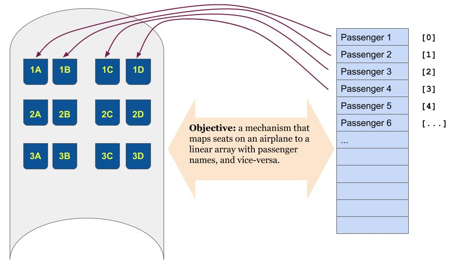

Review of Week 8: Arrays
=================================
 
A good way to introduce arrays is with a concrete example, showing some of the things we can do with them. An array is a collection of similar items. Each item occupies a position within the array and can be referenced by that position. Because each item is stored in the array, it does not require its own individual variable name. For example, the following code snippet computers the average temperature for one week.

.. code-block:: java
  
 float montemperatureAtNoon = 70;
 float tuetemperatureAtNoon = 63;
 float wedtemperatureAtNoon = 72;
 float thutemperatureAtNoon = 67;
 float fritemperatureAtNoon = 68;
 float sattemperatureAtNoon = 68;
 float suntemperatureAtNoon = 71;
 
 float weekAverage = ( montemperatureAtNoon + tuetemperatureAtNoon 
                     + wedtemperatureAtNoon + thutemperatureAtNoon 
                     + fritemperatureAtNoon + sattemperatureAtNoon
                     + suntemperatureAtNoon ) / 7.0;

In the code above, we initialize seven variables, one for each day of the week to record the temperature. Then we add these variables together and divide the sum by 7, to obtain the average temperature.
The code below achieves the same result, with a different approach.

The difference in the code below begins with the highlighted line. The command initializes an array to hold 7 different float values. The program then proceeds to add the values stored in an array, using a for-loop accessing one element of the array at a time.

.. code-block:: java
 :emphasize-lines: 1
  
 float[] temperatureAtNoon = new float(7);
 
 temperatureAtNoon[0] = 70;
 temperatureAtNoon[1] = 63;
 temperatureAtNoon[2] = 72;
 temperatureAtNoon[3] = 67;
 temperatureAtNoon[4] = 68;
 temperatureAtNoon[5] = 68;
 temperatureAtNoon[6] = 71;
 
 float weekAverage = 0;
 
 for (int day = 0; day < 7; day++) {
   weekAverage = weekAverage + temperatureAtNoon[day];
 }
 
 weekAverageHigh = weekAverageHigh / 7.0;

As the code above shows, an array is declared by an empty pair of square brakets next to the data type we wish to use; in the example above ``float[]``. The declaration includes the name we wish to give to the array. Next, the array is initialized to a specific size, by the command ``new`` and the size specification; in this example we initialize an array of 7 float variables. 

Values stored in the array can be accessed by the referencing the corresponding element, using an array index. The array index is an integer number enclosed in square brackets. The first element of the array corresponds to index ``[0]``. Often we need to traverse an array, looking at every element. This is accomplished with a loop in which an ``int`` variable is increment by 1 (using the ``++`` operator). In the example above, the variable ``day`` is used in a for-loop to access the 0th, 1st, 2nd, 3rd, 4th, 5th, and 6th place of the array -- in other words, all of its seven elements.

What makes arrays so useful and so interesting in programming is the ability to traverse them so easily. We can store values with a common property -- e.g., daily temperatures -- and then analyze them by traversing the array to find average values, as well as extreme values, and other properties. Using the example above, here's a simple code snippet to find the maximum daily high temperature

.. code-block:: java

 maxTemperature = temperatureAtNoon[0];
 for (int day = 1; day < 7; day++) {
   if ( temperatureAtNoon[day] > maxTemperature ) {
     maxTemperature = temperatureAtNoon[day];
   }
 }
 
Data analysis, shown in the examples above, is one of arrays' many application. Arrays, and array-based Classes, can be used to search data, map information, and organize knowledge. The next example shows how a linear (one-dimensional) array can produce two-dimensional information.

Airplane Seating
----------------

 

   
   Converting a passenger manifest to seating assignments in a (small) airplane. The manifest is a linear (one-dimensional) entity, while the seating assignment is a two-dimensional construct.

.. literalinclude:: ../codeExamples/AirplaneSeating/src/NaiveSeating.java
   :linenos:
   :emphasize-lines: 5
   :language: java
   
   